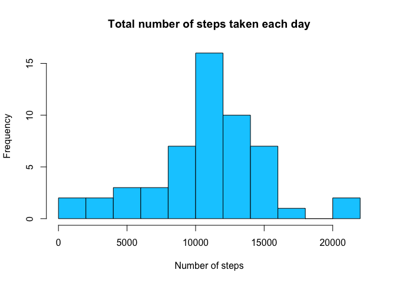
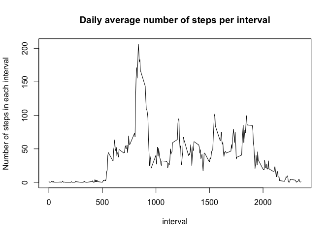
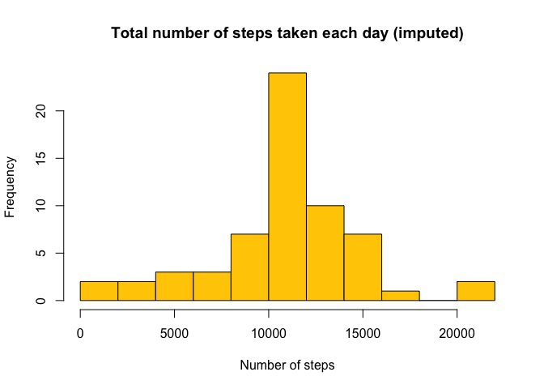

# Reproducible Research: Peer Assessment 1
Javier Estraviz  
March 9, 2015  


## Loading and preprocessing the data

NOTE: We are assuming that the working directory has been previously selected in 
RStudio and is the same one where this R markdown file is located.


```r
# Uncompress zip file if its content hasn't been unzipped before
if(!file.exists("./activity.csv")) {
  unzip("activity.zip")
}

# Load the data
activity <- read.csv("./activity.csv")
# Transform the dates into type "Date"
activity$date <- as.Date(activity$date)
```

With the previous instructions, we have already read the file and assured that
the variable that contains a date is type Date.


## What is mean total number of steps taken per day?

First, we are going to calculate the total number of steps taken per day.


```r
total_steps_day <- with(activity,aggregate(steps,by=list(date),sum))
colnames(total_steps_day) <- c("date","total_steps")
```

Now, let's plot a histogram of the daily aggregated data:


```r
hist(total_steps_day$total_steps,breaks=10,col="#00CCFF",
     main="Total number of steps taken each day",xlab="Number of steps")
```

 

Next, we'll calculate the mean and the median of the total number of daily 
steps.


```r
mean_daily_steps <- round(mean(total_steps_day$total_steps,na.rm=TRUE),digits=2)
median_daily_steps <- median(total_steps_day$total_steps,na.rm=TRUE)
```

That is, the mean is:


```r
mean_daily_steps
```

```
## [1] 10766.19
```

The calculated median is:


```r
median_daily_steps
```

```
## [1] 10765
```


## What is the average daily activity pattern?

For this part of this study, we are going to depict a time series plot of the 
5-minute interval (in the x-axis) and the average number of steps taken,
averaged across all days (in the y-axis). We can do this with the following set
of instructions:


```r
avg_steps_day <- with(activity,aggregate(steps,by=list(interval),mean,
                                         na.rm=TRUE))

colnames(avg_steps_day) <- c("interval","avg_steps")

plot(x=avg_steps_day$interval,y=avg_steps_day$avg_steps,type="l",     
     xlab="interval",
     ylab="Number of steps in each interval",
     main="Daily average number of steps per interval")
```

 

Let's obtain which 5-minute interval on average across all the days in the 
dataset contains the maximum number of steps. The so calculated value is:


```r
max_num_steps_interval <- avg_steps_day[avg_steps_day$avg_steps == 
                                          max(avg_steps_day$avg_steps),][1]
max_num_steps_interval
```

```
##     interval
## 104      835
```

The interval is 835, a value between 500 and 1000 steps, 
as we could have approximatedly guessed from the previous graph.


## Imputing missing values

A quick preview of the first lines of the dataset shows us that there are some
dates where the data for steps are not available. The total number of the 
missing values is:


```r
nrow(activity[is.na(activity$steps),])
```

```
## [1] 2304
```

Now we'll create a new dataset, equal to the original one, but with the missing
data filled in. Let's replace those NA's or not available values with the mean
value for each time interval, in the whole dataset.


```r
act_full <- activity
act_full$steps <- ifelse(is.na(activity$steps),
                         avg_steps_day$avg_steps[match(act_full$interval,
                                                       avg_steps_day$interval)],
                         act_full$steps)
```

Once we have replaced the missing values, we can make a new histogram of the 
total number of steps taken each day:


```r
total_steps_day_imp <- with(act_full,aggregate(steps,by=list(date),sum))

colnames(total_steps_day_imp) <- c("date","total_steps")

hist(total_steps_day_imp$total_steps,breaks=10,col="#FFCC00",
     main="Total number of steps taken each day (imputed)",
     xlab="Number of steps")
```

 

Similarly to what we have done before, we can calculate the mean and median of 
the total number of steps taken per day, this way:


```r
mean_daily_steps_imp <- round(mean(total_steps_day_imp$total_steps,na.rm=TRUE),
                              digits=2)

median_daily_steps_imp <- median(total_steps_day_imp$total_steps,na.rm=TRUE)
```

The new mean with imputed values is:


```r
mean_daily_steps_imp
```

```
## [1] 10766.19
```

The new median with imputed values is:


```r
median_daily_steps_imp
```

```
## [1] 10766.19
```

To the question *Do these values differ from the estimates from the first part 
of the assignment?* we can answer that, as we have replaced missing values with 
the corresponding means of each interval, the new calculated mean is not 
modified, but the median varies slightly (10766.19 
after the imputation of missing values vs 10765, without it).
As we can see, now mean and median have the same value.


## Are there differences in activity patterns between weekdays and weekends?

To conclude the study, we are going to clasify the weekdays of the data variable
in the dataset as *weekday* and *weekend*. Let's create a new factor variable
(in the dataset with the filled-in missing values) for this:


```r
# Note that the following instructions take into consideration that the days of
# the week vary from 0-6, starting on Sunday (so 0 and 6 are weekend days):
act_full$day_of_week <- ifelse(as.POSIXlt(act_full$date)$wday > 0 & 
                                 as.POSIXlt(act_full$date)$wday < 6,
                               "weekday","weekend")
```

Finally, we'll depict a new time series plot of the 5-minute interval (in the 
x-axis) and the average number of steps taken, averaged across all weekday days
or weekend days (in the y-axis). We distinguish between these two types of days
in two graphs, one above the other:


```r
avg_steps_weekday <- with(act_full,aggregate(steps,
                                             by=list(day_of_week,interval),
                                             mean)) 
colnames(avg_steps_weekday) <- c("day_of_week","interval","avg_steps")

# We'll use the lattice graphics package for this
library(lattice)
xyplot(avg_steps ~ interval | day_of_week,data=avg_steps_weekday,type="l",
       layout=c(1,2),xlab="Interval",ylab="Number of steps")
```

 

Observing the graph we can conclude that the activity is higher on weekdays, for
the first part of the time intervals considered, while we have the contrary 
situation (higher activity during weekend days) for the last part of the 
measured intervals.
